```{=html}
<header>
  <div class="tag">ECE 484 · Spring 2026 · Final Results</div>
  <h1>Reactive Autonomous Racing with F1TENTH Car</h1>
  <p>
    We improved a baseline LiDAR wall following controller into a race ready autonomous driving stack,
    tested multiple planning strategies, and completed the final class race with an approximately one minute lap time.
  </p>

  <div class="hero-grid">
    <div class="stat"><div class="num">~1:00</div><div class="label">Final race time on hardware</div></div>
    <div class="stat"><div class="num">3+</div><div class="label">Controller algorithms tested</div></div>
    <div class="stat"><div class="num">/scan</div><div class="label">Primary sensing input from LiDAR</div></div>
  </div>
</header>

<nav>
  <a href="#intro">Intro</a>
  <a href="#system">System</a>
  <a href="#approach">Approach</a>
  <a href="#methods">Methods</a>
  <a href="#final">Algorithm</a>
  <a href="#final-results">Final Run</a>
  <a href="#comparison">Metrics</a>
  <a href="#debugging">Debugging</a>
  <a href="#data-notes">Data Notes</a>
  <a href="#media">Videos</a>
  <a href="#team">Team</a>
</nav>

<main>
  <section id="intro">
    <div class="section-label">01 / Introduction</div>
    <h2>Project Goal</h2>
    <p class="lead">
      Our goal was to make a 1/10 scale F1TENTH racecar drive around an unknown race track as quickly and reliably as possible using real time LiDAR feedback. The final evaluation was a class race where each team competed for the fastest completed run.
    </p>

    <div class="grid">
      <div class="card span-6">
        <h3>What we optimized for</h3>
        <ul>
          <li>Finish the complete race track without collisions or manual rescue.</li>
          <li>Increase straight line speed when the car had open space ahead.</li>
          <li>Slow down when steering demand indicated a sharp corner.</li>
          <li>Keep the controller simple enough to tune and debug on hardware.</li>
        </ul>
      </div>

      <div class="card span-6">
        <h3>Final outcome</h3>
        <p>
          Our final car completed the race in roughly one minute, placing near the middle of the class. The result showed that our reactive controller was reliable enough to complete the course, while our main limitation was speed through corners and the conservative speed caps needed for robustness.
        </p>
      </div>
    </div>
  </section>

  <section id="system">
    <div class="section-label">02 / Overall System</div>
    <h2>Autonomous Driving Stack</h2>
    <p class="lead">
      The hardware system used LiDAR scans as the main perception input. Our ROS2 node converted each scan into a steering and speed command, then published Ackermann drive messages to the car.
    </p>

    <div class="system-diagram">
  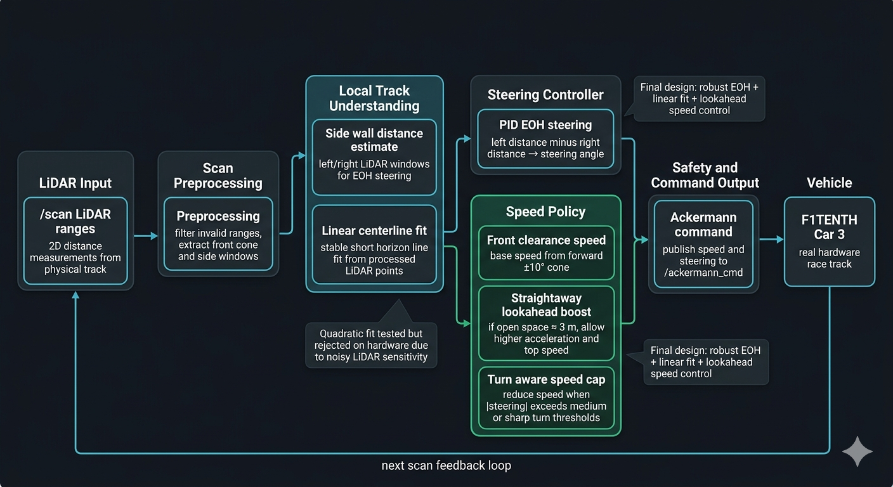
</div>

    <div class="grid top-space">
      <div class="card span-4">
        <h3>Perception</h3>
        <p>Use 2D LiDAR ranges to estimate open space ahead and wall distance on the left and right sides of the car.</p>
      </div>

      <div class="card span-4">
        <h3>Planning</h3>
        <p>Tested centerline fitting, MPC with pure pursuit, and a final reactive EOH style controller.</p>
      </div>

      <div class="card span-4">
        <h3>Control</h3>
        <p>Publish steering angle and speed to <code>/ackermann_cmd</code>, with manual enable through the Y button on the controller.</p>
      </div>
    </div>
  </section>

  <section id="approach">
    <div class="section-label">03 / Approach</div>
    <h2>Approach and Controller Improvements</h2>
    <p>
      Our goal was to improve the original EOH baseline into a controller that could complete the physical F1TENTH race track reliably. Instead of only trying to maximize speed, we focused on making the car adapt its behavior to the local track geometry using LiDAR. The final controller combined reactive wall following with turn aware speed limits, straightaway lookahead boosting, and lessons from centerline polynomial fitting experiments.
    </p>

    <div class="grid">
      <div class="card span-6">
        <h3>Baseline EOH Controller</h3>
        <p>
          The original controller compared LiDAR readings on the left and right sides of the car, used a PID style steering correction to stay centered, and set speed mostly from the distance directly in front of the car. This worked as a starting point, but it did not clearly distinguish between straights, medium turns, and sharp turns.
        </p>
      </div>

      <div class="card span-6">
        <h3>Turn Aware Speed Scheduling</h3>
        <p>
          We added speed scheduling based on steering magnitude. When the controller commanded a larger steering angle, the car reduced speed before entering the turn. This prevented the car from taking sharp corners too aggressively and made the behavior more stable on the physical track.
        </p>
      </div>

      <div class="card span-6">
        <h3>Straightaway Lookahead Boost</h3>
        <p>
          We also added a forward LiDAR lookahead condition. When the front cone detected roughly 3 meters of open space, the controller allowed stronger acceleration and a higher top speed. This let the car take advantage of straightaways instead of driving at one conservative speed everywhere.
        </p>
      </div>

      <div class="card span-6">
        <h3>Centerline and Polynomial Fitting Experiments</h3>
        <p>
          In parallel, we explored a planning based approach using processed LiDAR points to estimate the local centerline of the track. Linear fitting gave a stable short horizon estimate, while quadratic polynomial fitting was tested to better represent curved sections. On hardware, the polynomial approach was more sensitive to noisy or missing LiDAR points, so our final race strategy kept the robustness of EOH while borrowing the idea of lookahead based speed planning.
        </p>
      </div>
    </div>
  </section>

  <section id="methods">
    <div class="section-label">04 / Methods</div>
    <h2>Controller Development Timeline</h2>
    <p>
      Our project evolved through several controller designs. We started with a direct EOH baseline, explored more complex planning methods, then returned to a tuned EOH controller because it was the most reliable on the physical car.
    </p>

    <div class="timeline">
      <div class="timeline-item">
        <h3>1. Direct Baseline EOH</h3>
        <p>We began with a direct LiDAR to Ackermann controller. It was fast in some sections, but it required large steering corrections and was not reliable enough for the full race.</p>
      </div>

      <div class="timeline-item">
        <h3>2. Centerline and Polynomial Planning</h3>
        <p>We tested processed LiDAR centerline estimation using linear and quadratic polynomial fitting. This helped us understand the value of lookahead planning, but it was harder to make robust with noisy hardware LiDAR data.</p>
      </div>

      <div class="timeline-item">
        <h3>3. MPC and Pure Pursuit Experiments</h3>
        <p>We explored an MPC and pure pursuit style pipeline with local path generation, target speed commands, and raw drive outputs. This approach was more structured, but it required more tuning and was less reliable under final hardware constraints.</p>
      </div>

      <div class="timeline-item">
        <h3>4. Scared Stop and Safety Tuning</h3>
        <p>Overly conservative safety thresholds caused the car to stop too often near walls and tight turns. We tuned the behavior so the car would crawl or slow down instead of fully stopping whenever LiDAR saw a close obstacle.</p>
      </div>

      <div class="timeline-item">
        <h3>5. Final Tuned EOH Controller</h3>
        <p>The final controller kept the reliability of EOH but added turn aware speed caps and a forward lookahead boost. This allowed the car to slow down for high steering sections while still accelerating on open straightaways.</p>
      </div>
    </div>
  </section>

  <section id="final">
    <div class="section-label">05 / Final Algorithm</div>
    <h2>Race Controller</h2>

    <p class="lead">
      The final controller preserved the reliability of the simple EOH wall following baseline, but added more context aware planning around speed and track shape. Instead of using one fixed behavior everywhere, the controller adjusted speed based on forward LiDAR clearance, steering demand, straightaway detection, and a fitted local centerline estimate.
    </p>

    <div class="grid">
      <div class="card span-6">
        <h3>Steering and Local Track Estimate</h3>
        <ul>
          <li>Sample LiDAR windows around +60° and -60° to estimate side wall distances.</li>
          <li>Compute EOH steering error as left distance minus right distance.</li>
          <li>Use PID terms to convert wall distance error into steering.</li>
          <li>Fit a local centerline using a linear polynomial model on processed LiDAR points.</li>
          <li>Use the fitted centerline as a smoother estimate of where the car should point through the next short horizon.</li>
        </ul>
      </div>

      <div class="card span-6">
        <h3>Speed and Lookahead Logic</h3>
        <ul>
          <li>Use the minimum distance in the forward ±10° LiDAR cone to estimate open space.</li>
          <li>Use a roughly 3 m lookahead condition to detect straightaways.</li>
          <li>Allow stronger acceleration and a higher top speed when the car sees open track ahead.</li>
          <li>Reduce speed when steering magnitude indicates a medium or sharp turn.</li>
          <li>Crawl or slow down near close obstacles instead of immediately hard stopping.</li>
        </ul>
      </div>
    </div>

    <div class="grid top-space">
      <div class="card span-6">
        <h3>Why Linear Fitting Instead of Quadratic?</h3>
        <p>
          We tested both linear and quadratic polynomial centerline fitting. Quadratic fitting seemed ideal because it could represent curved track sections, but on the physical car it became sensitive to noisy or missing LiDAR points. In hardware tests, the quadratic fit sometimes overreacted to local scan noise and produced unstable path estimates.
        </p>
        <p>
          For the final hardware controller, we used a simpler linear polynomial fit because it gave a more stable short horizon centerline estimate. This was a better match for the high speed constraints of the race.
        </p>
      </div>

      <div class="card span-6">
        <h3>Final Design Choice</h3>
        <p>
          Our final approach was not just the original EOH controller with speed control. It combined reactive wall following, a stable linear centerline estimate, steering aware speed caps, and a forward LiDAR lookahead boost. This let the car slow down for turns while still taking advantage of open straightaways.
        </p>
      </div>
    </div>

    <div class="card span-12 top-space">
  <h3>Turn Aware Speed Cap</h3>
  <pre><code>abs_steer = abs(steer)

if abs_steer &gt; 0.32:
    speed = min(speed, 0.80)
elif abs_steer &gt; 0.22:
    speed = min(speed, 1.05)</code></pre>
</div>

    <div class="card span-12 top-space">
  <h3>Straightaway Lookahead Boost</h3>
  <pre><code>if front_clearance &gt; 3.0 and abs_steer &lt; 0.12:
    speed = min(speed + straightaway_boost, higher_top_speed)</code></pre>
  <p>
    This logic allowed the car to accelerate more aggressively only when the front LiDAR cone showed enough open space and the steering demand was low.
  </p>
</div>
  </section>

  <section id="final-results">
    <div class="section-label">06 / Final Results</div>
    <h2>Successful Real Track Run</h2>
    <p>
      The successful real track run demonstrates why our final controller used both turn aware and straightaway aware speed control. The car frequently required large steering corrections on the physical course, so driving at the early EOH speed was reckless. In the final controller, speed was reduced when steering magnitude increased, while the forward LiDAR lookahead boost allowed faster motion when the car saw open track ahead.
    </p>

    <div class="callout">
      <strong>Final race outcome:</strong> Our car completed the physical race track with an approximate lap time of one minute, placing around the middle of the class. The final controller was not the fastest in raw speed, but it achieved reliable autonomous completion on hardware.
    </div>

    <div class="media-grid">
      <div class="media-item">
        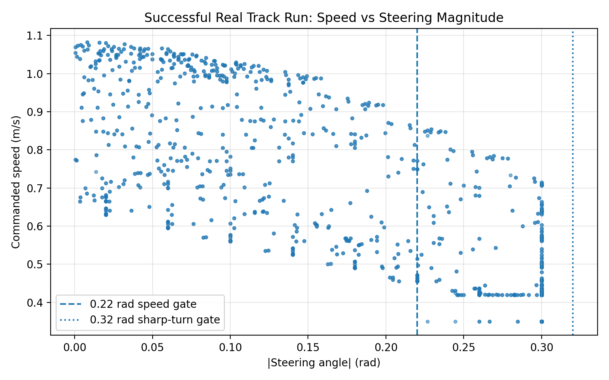
        <div class="caption"><strong>Speed vs steering magnitude.</strong> Higher speed appears on straights, while speed drops as steering demand increases. This directly shows the turn aware speed schedule used in the final controller.</div>
      </div>

      <div class="media-item">
        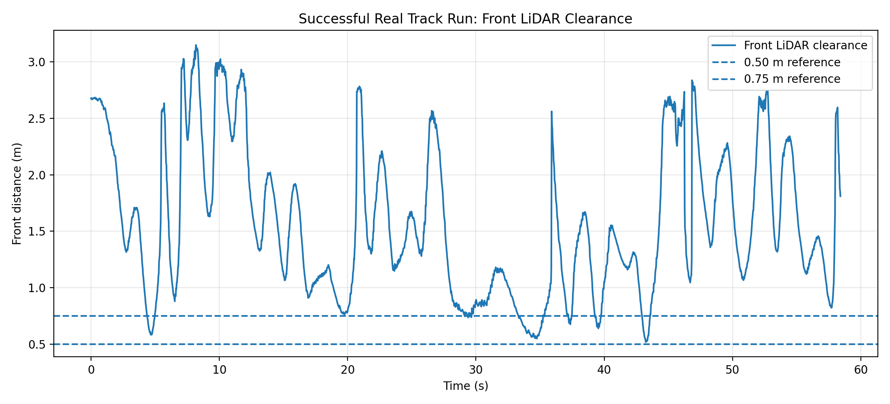
        <div class="caption"><strong>Front LiDAR clearance.</strong> The car generally stayed above the safety reference lines, with brief dips in tighter sections of the course.</div>
      </div>

      <div class="media-item">
        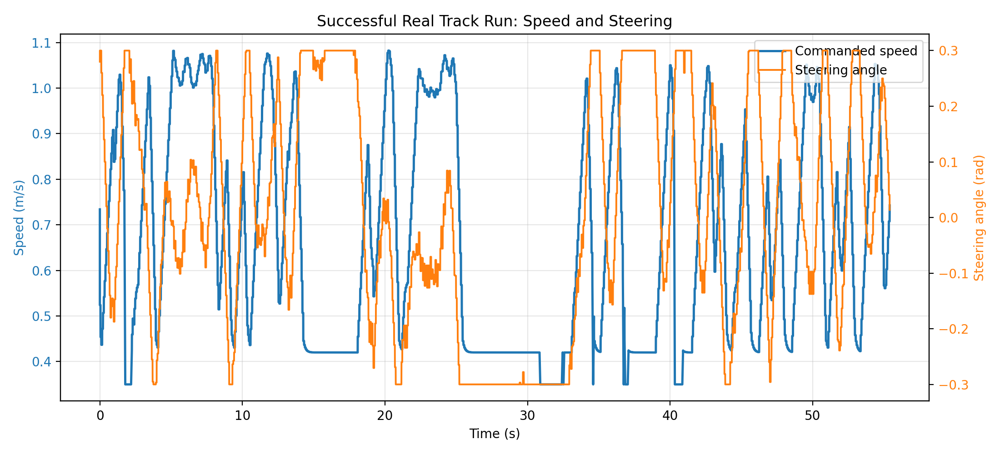
        <div class="caption"><strong>Speed and steering over time.</strong> The controller continuously corrected steering from LiDAR feedback while adjusting speed through different track sections.</div>
      </div>

      <div class="media-item">
        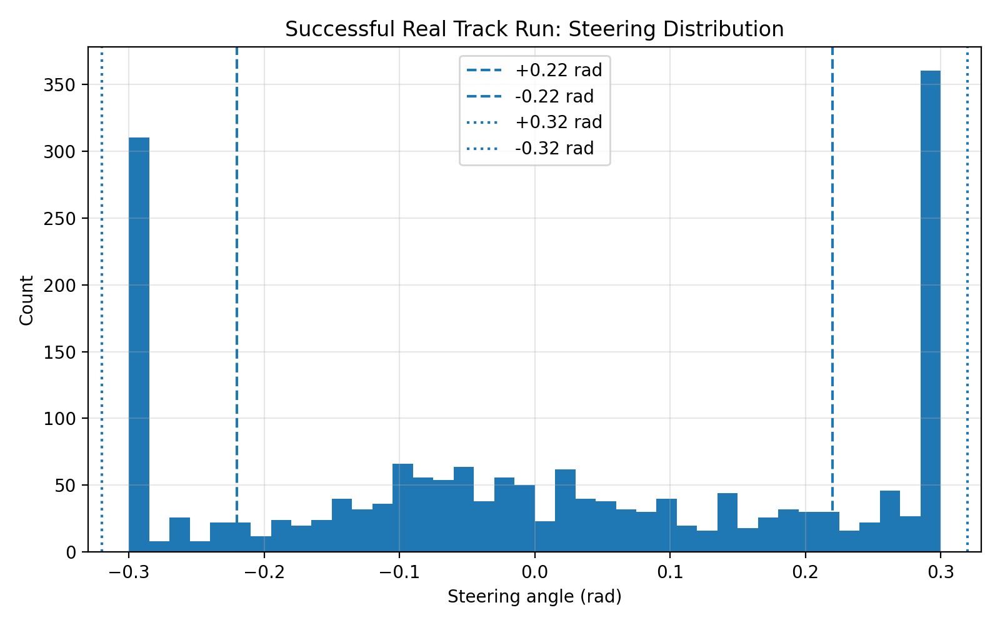
        <div class="caption"><strong>Steering distribution.</strong> Frequent large steering commands show why speed limiting was necessary on the physical track.</div>
      </div>
    </div>
  </section>

  <section id="comparison">
    <div class="section-label">07 / Evaluation</div>
    <h2>Algorithm Comparison and Metrics</h2>
    <p>
      We evaluated readable real hardware rosbags using commanded speed, steering effort, steering smoothness, front LiDAR clearance, stop command frequency, and run duration. These metrics show the core tradeoff: raw speed alone did not produce the best race behavior. The final controller prioritized reliable completion by combining turn aware speed caps with a straightaway lookahead boost.
    </p>

    <div class="card">
      <h3>Key result</h3>
      <p>
        The early direct EOH run commanded the highest mean positive speed, but the successful real track run completed the course with more controlled behavior. The final improvement was not simply lowering the speed. It made speed depend on context: slower in turns, faster on open straightaways, and safer near close obstacles.
      </p>
    </div>

    <div class="media-grid">
      <div class="media-item">
        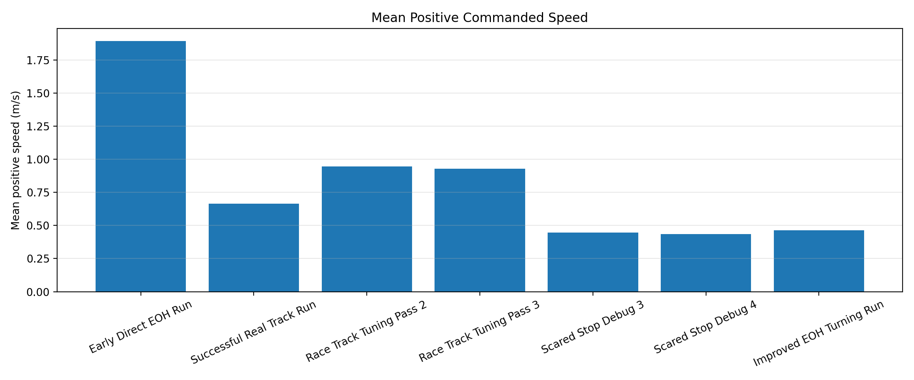
        <div class="caption"><strong>Mean positive speed.</strong> The early EOH run was faster, but the final real track run was more reliable because it used context aware speed control instead of constant aggressive speed.</div>
      </div>

      <div class="media-item">
        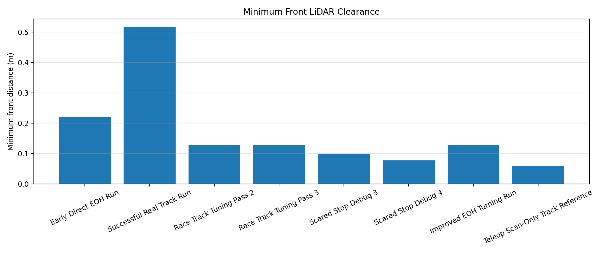
        <div class="caption"><strong>Minimum front clearance.</strong> The successful real track run maintained the strongest minimum clearance, showing that final tuning improved safety margin.</div>
      </div>

      <div class="media-item">
        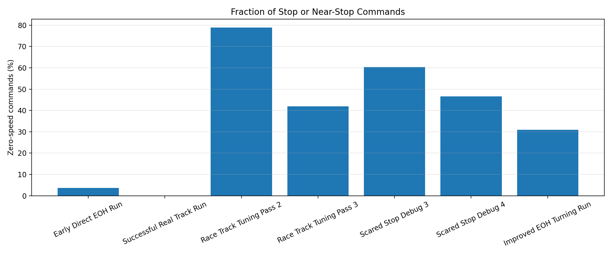
        <div class="caption"><strong>Stop frequency.</strong> The scared stop debug runs show the failure mode where the car became too conservative. Final tuning reduced unnecessary stopping while preserving safety.</div>
      </div>

      <div class="media-item">
        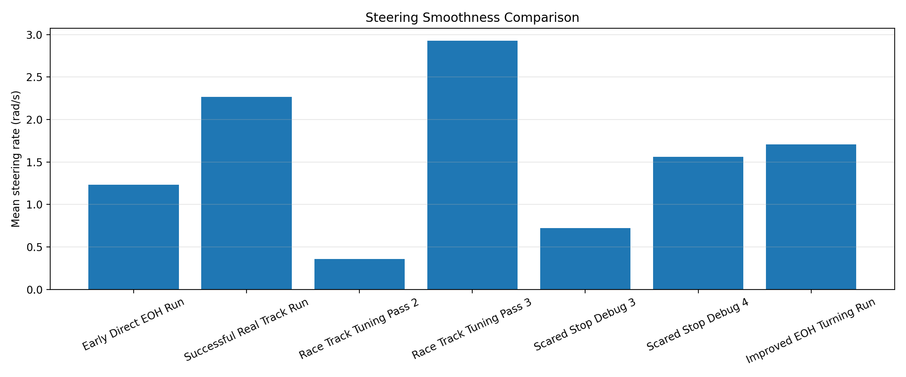
        <div class="caption"><strong>Steering smoothness.</strong> Aggressive race tuning produced less stable steering behavior, while the final controller balanced responsiveness with reliability.</div>
      </div>
    </div>
  </section>

  <section id="debugging">
    <div class="section-label">08 / Debugging</div>
    <h2>Debugging and Tuning Progression</h2>
    <p>
      Our final controller came from several hardware tuning cycles. The race track tuning bags show what happened when we pushed speed too aggressively, while the scared stop debug bags show how overly conservative thresholds caused the car to slow or stop too often. These experiments motivated the final balance between speed, steering, and forward clearance.
    </p>

    <div class="media-grid">
      <div class="media-item">
        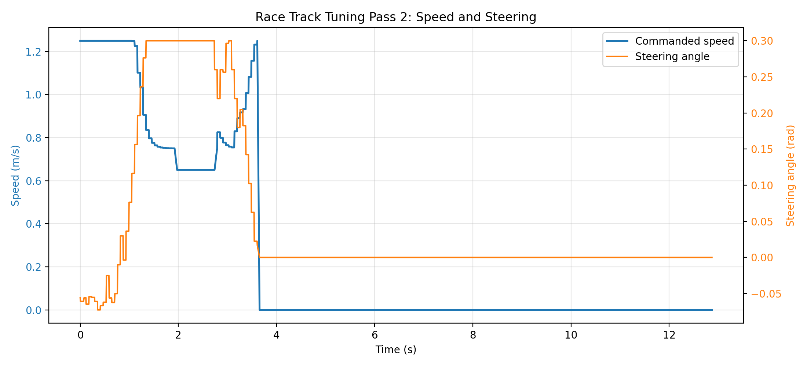
        <div class="caption"><strong>Race Track Tuning Pass 2.</strong> This aggressive test failed quickly, showing that increasing speed without enough turn awareness was not reliable.</div>
      </div>

      <div class="media-item">
        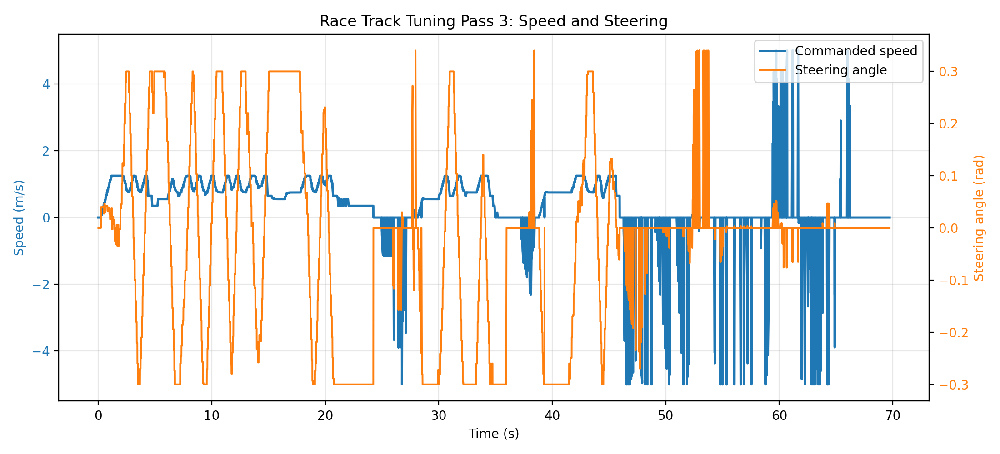
        <div class="caption"><strong>Race Track Tuning Pass 3.</strong> Adjusted gates still produced unstable command behavior and speed spikes, motivating more conservative final scheduling.</div>
      </div>

      <div class="media-item">
        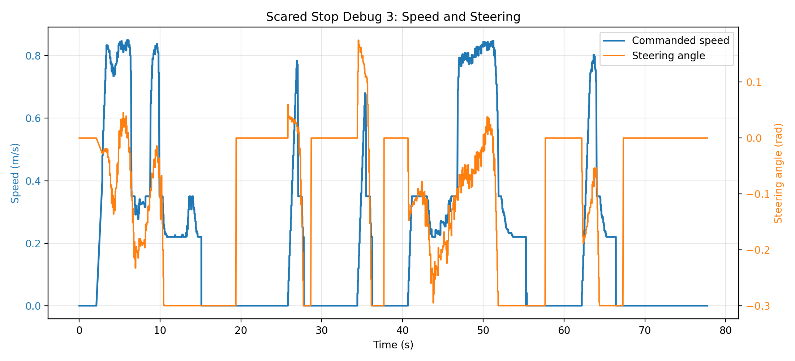
        <div class="caption"><strong>Scared Stop Debug 3.</strong> The controller frequently slowed or stopped while we tuned steering sensitivity and safety thresholds.</div>
      </div>

      <div class="media-item">
        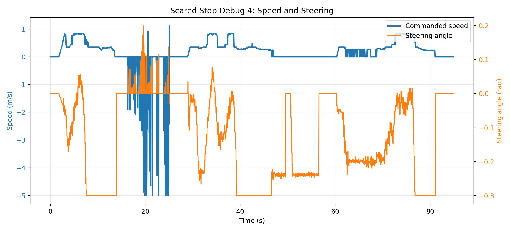
        <div class="caption"><strong>Scared Stop Debug 4.</strong> This run tested softer crawl behavior instead of hard stopping.</div>
      </div>

      <div class="media-item">
        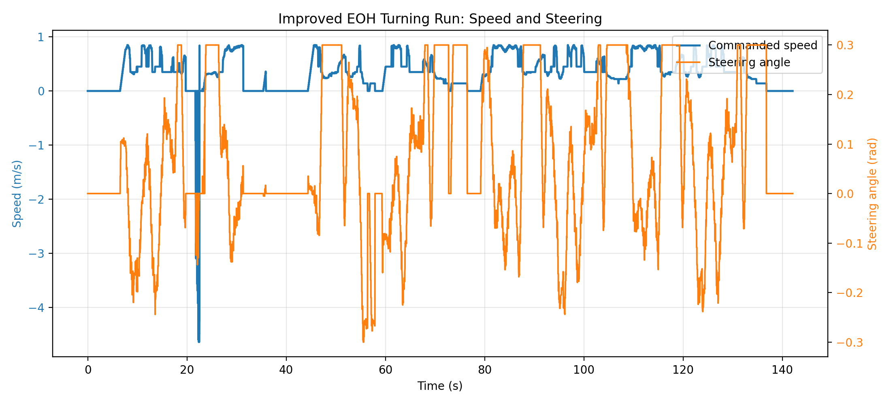
        <div class="caption"><strong>Improved EOH Turning Run.</strong> This was the longest readable autonomous tuning run and showed improved turn reaction, though it still struggled with tight sections before final tuning.</div>
      </div>

      <div class="media-item">
        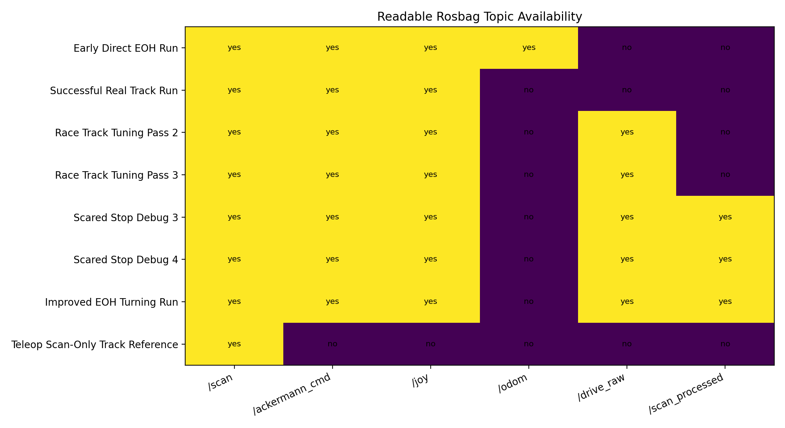
        <div class="caption"><strong>Topic availability.</strong> Quantitative plots were generated only from bags that could be read successfully. Corrupted bags were used only for methods context.</div>
      </div>
    </div>
  </section>

  <section id="data-notes">
    <div class="section-label">09 / Data Notes</div>
    <h2>Rosbag Limitations and Honest Evaluation</h2>

    <div class="grid">
      <div class="card span-6">
        <h3>Readable data only</h3>
        <p>
          Some rosbag databases from Google Drive could not be deserialized, so we did not include them in quantitative plots. Those bags still appear in the methods timeline when useful, but the graphs use only readable databases.
        </p>
      </div>

      <div class="card span-6">
        <h3>Trajectory limitation</h3>
        <p>
          The successful real track run did not include <code>/odom</code>, so its final performance is shown using speed, steering, and LiDAR clearance. The early EOH bag can be used separately for an odometry trajectory visualization because it recorded <code>/odom</code>.
        </p>
      </div>
    </div>
  </section>

  <section id="media">
    <div class="section-label">10 / Videos</div>
    <h2>Annotated Race Videos</h2>

    <div class="media-grid">
      <div class="media-item">
        <video src="static/videos/Final_Race.mov" controls muted playsinline></video>
        <div class="caption"><strong>Final race video.</strong> Final race demo with James.</div>
      </div>

      <div class="media-item">
        <video src="static/videos/Short_Test.MOV" controls muted playsinline></video>
        <div class="caption"><strong>Short tuning video.</strong> Short track run to tune before final demo.</div>
      </div>
    </div>
  </section>

  <section id="team">
    <div class="section-label">11 / Team</div>
    <h2>Team eyuhh67 · Car 3</h2>

    <div class="grid">
      <div class="card span-6">
        <h3>Pradyun Chandramouli</h3>
        <p>Algorithm development, ROS2 testing, hardware tuning, results analysis, and website writeup.</p>
      </div>

      <div class="card span-6">
        <h3>Shashwath Thiyagarajan</h3>
        <p>Algorithm development, simulation testing, hardware tuning, and race evaluation.</p>
      </div>
    </div>
  </section>
</main>

<footer>
  <span>ECE 484 · Autonomous Vehicles · UIUC · Spring 2026</span>
  <span>Final Project Results Website</span>
</footer>
```